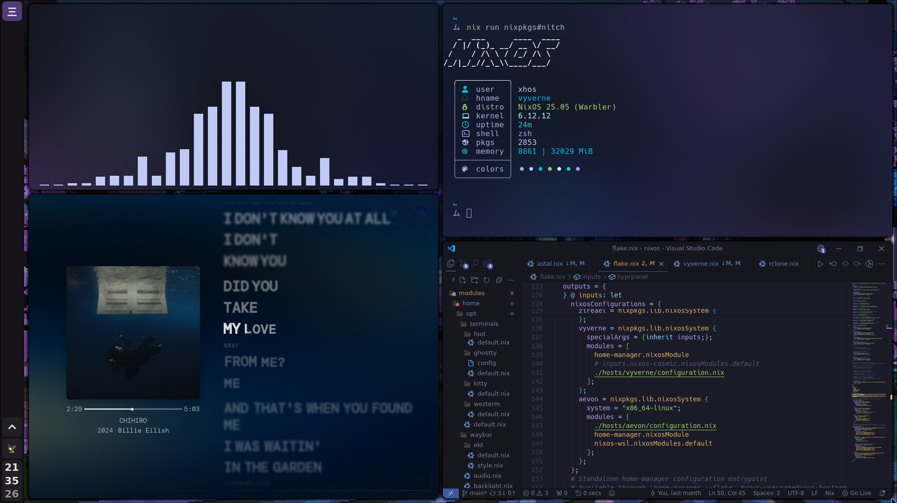

# ❄️ nixdots

old screenshots

## old setup using [aard](https://github.com/xhos/aard)

  
   
  
  

all wallpapers can can be found [here](https://pics.xhos.dev/folder/cmgs64vh4000amzfs6t7oqy3f)

## 🌌 main features

- modular setup, everything is toggleable and switchable
- easy full system theming with stylix, based on the wallpaper or a base16 scheme
- secret management with sops-nix
- touch support with hyprgrass
- integrated onedrive & protondrive mounts 
- preconfigured web apps
- fully-themed login screens with sddm and grub

## 🏠 homelab

[enrai](../hosts/enrai) is my headless optiplex 5050 running a bunch of cool things, ~99% declarative. zsh, impermanence, secrets, all that good stuff:

- networking: caddy reverse proxy with cloudflare acme + nat port forwarding over wirguard to the vps running my [nix-wg-proxy](https://github.com/xhos/nix-wg-proxy)
- media pipeline: jellyfin + the usual *arr stack + qbittorrent with proton vpn
- home assistant: yandex station max controlling wled and [wled-album-sync](https://github.com/xhos/wled-album-sync)
- proxmox-nix running 2 vms, one for game servers, other for amnezia vpn (the only not fully declarative part)
- zipline, wakapi, synthing, glance and more

## 📦 repo structure

- **[derivs](../derivs):** nixpkgs overlays/derivations
- **[home](../home):** per host home-manager entrypoints
- **[hosts](../hosts):** host-specific configurations
- **[modules](../modules):**
  - **[home](../modules/home):** home-manager related modules
    - **[core](../modules/home/core):** core modules
    - **[opt](../modules/home/opt):** optional and toggleable modules
  - **[nixos](../modules/nixos):** nixos related modules
    - **[core](../modules/nixos/core):** core modules
    - **[opt](../modules/nixos/opt):** optional and toggleable modules

## ℹ️ info

| component          | details                                                 |
| ------------------ | ------------------------------------------------------- |
| de/wm              | [hyprland](https://hypr.land/)                          |
| greeter            | [yawn](https://github.com/xhos/yawn) (i made this!)     |
| terminal           | [foot](https://codeberg.org/dnkl/foot)                  |
| shell              | [zsh](https://www.zsh.org/)                             |
| bar                | [waybar](https://github.com/Alexays/Waybar)             |
| browser            | [zen](https://zen-browser.app)                          |
| runner             | [rofi](https://github.com/davatorium/rofi)              |
| prompt             | [starship](https://starship.rs/)                        |
| file manager       | [nautilus](https://apps.gnome.org/Nautilus/)            |
| notification       | [mako](https://github.com/emersion/mako)                |
| clipboard manager  | [clipse](https://github.com/savedra1/clipse)            |
| fetch              | [fastfetch](https://github.com/fastfetch-cli/fastfetch) |

## 🔒️ hyprlock

| name | preview | sources |
| :--- | :--- | :--- |
| **Main (Animated)** |  | [config](https://github.com/xhos/nixdots/tree/9692b91df9fa7896a59af807010780d1c9bffad7/modules/home/opt/hypr/hyprlock/hyprlock.conf)   [assets](https://github.com/xhos/nixdots/tree/9692b91df9fa7896a59af807010780d1c9bffad7/modules/home/opt/hypr/hyprlock/assets/)   [scripts](https://github.com/xhos/nixdots/tree/9692b91df9fa7896a59af807010780d1c9bffad7/modules/home/opt/hypr/hyprlock/scripts/)   [fonts](../modules/home/core/fonts/font-files/) |
| **Alternative (Static)** |  | [config](https://github.com/xhos/nixdots/tree/9692b91df9fa7896a59af807010780d1c9bffad7/modules/home/opt/hypr/hyprlock/hyprlock-alt.conf)   [assets](https://github.com/xhos/nixdots/tree/9692b91df9fa7896a59af807010780d1c9bffad7/modules/home/opt/hypr/hyprlock/assets/)   [scripts](https://github.com/xhos/nixdots/tree/9692b91df9fa7896a59af807010780d1c9bffad7/modules/home/opt/hypr/hyprlock/scripts/)   [fonts](../modules/home/core/fonts/font-files/) |

fonts used are:

- Maratype (credit to @notevencontestplayer on discord)
- KH Interference
- Synchro
- Nimbus Sans L Thin
- Nimbus Sans Black

## 🖌️ themed apps

> [!note]
> most of these automatically follow the stylix color scheme

- discord:  [system24](https://github.com/refact0r/system24)
- firefox:  [scifox](https://github.com/scientiac/scifox)
- obsidian: [anuppuccin](https://github.com/AnubisNekhet/AnuPpuccin)
- spotify:  [text](https://github.com/spicetify/spicetify-themes/tree/master/text)
- and more that i'm forgetting...

## 💡 acknowledgments

- [@joshuagrisham](https://github.com/joshuagrisham) for his work on [the galaxy book driver](https://github.com/joshuagrisham/samsung-galaxybook-extras)
- [@itzderock](https://github.com/ItzDerock) for sharing his [nix derivation](https://github.com/joshuagrisham/samsung-galaxybook-extras/issues/14#issue-2328871732) for that driver (now irrelevant since it was merged upstream)
- [@elyth](https://github.com/elythh), my config started as a fork of his [flake](https://github.com/elythh/flake)
- [hyprstellar](https://github.com/xeji01/hyprstellar/tree/main) for icons and general style inspiration

temp for my own reference, pretend its not here, github just renders it nicely:

